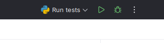
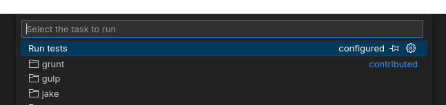

IDE
===

It's obvious that any developer can use the tools they prefer to work on the project. However, it's important to have a
"recommended" setup that can be used as a reference.

Choosing an IDE
---------------

As of IDEs, we more or less have two options:

1. `PyCharm <https://www.jetbrains.com/pycharm/>`_: It's a very powerful IDE with a lot of features. It's the one I use and I'm very happy with it. It has a
   free version that is more than enough for our needs, but the paid version can be obtained for free if you have a
   student email.
2. `VSCode <https://code.visualstudio.com/>`_: It's a very popular code editor that has a lot of extensions that can make it very powerful. It's free and
   open-source.

Pretty much any of these two options will be good enough for our needs. However, I think there's an important thing
for us to consider, and it's remote development.

- **PyCharm** has a plugin for remote development, but it's not free. However, again, with the student license, it can
  be obtained for free.

- **VSCode** has a free plugin for remote development that is very good.

Personally, because of personal choice, professional experience, and of course because I have a student email, I use PyCharm.

However, as an open source project, I believe we should provide support at least for VSCode, because it's free, open-source,
and probably the most popular code editor right now.

Pre-Configuration
-----------------

The good thing about IDEs, is that you can configure them to work with the tools you want, and automate a lot of things.

For example, for running tests, we can configure the IDE to run the tests with a single click. For PyCharm:

Or VSCode:

This configuration can be added to VCS, so that by simply cloning the repository, the developer can have the same setup.
