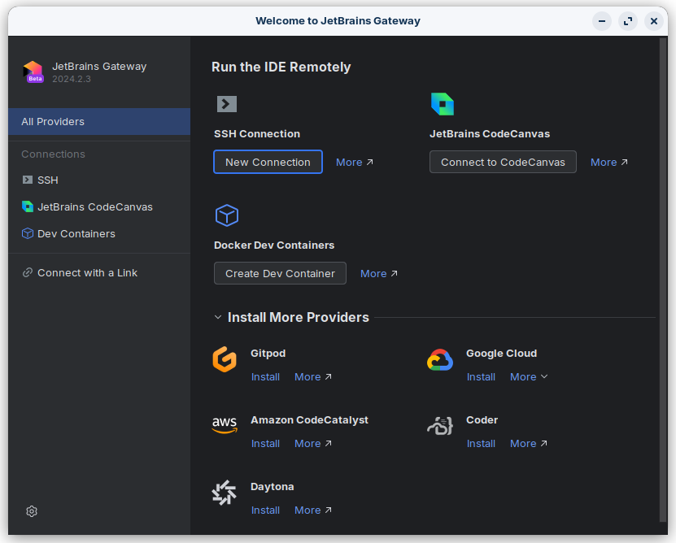
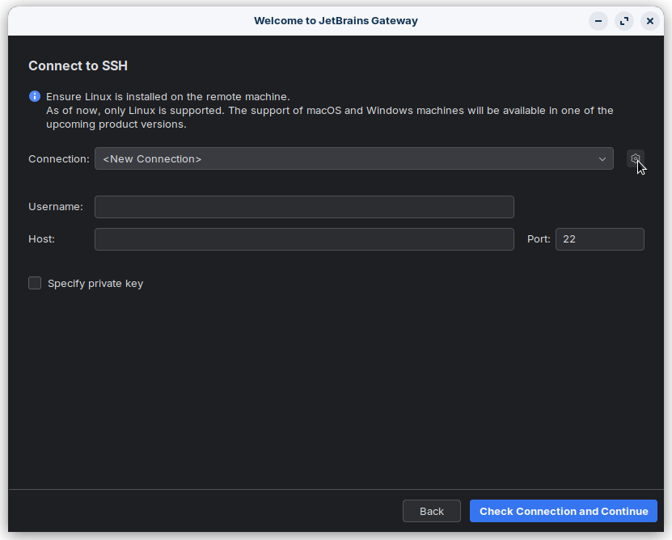
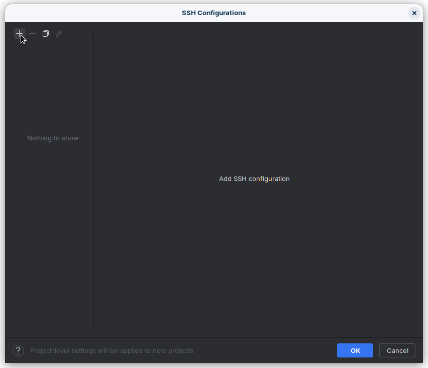
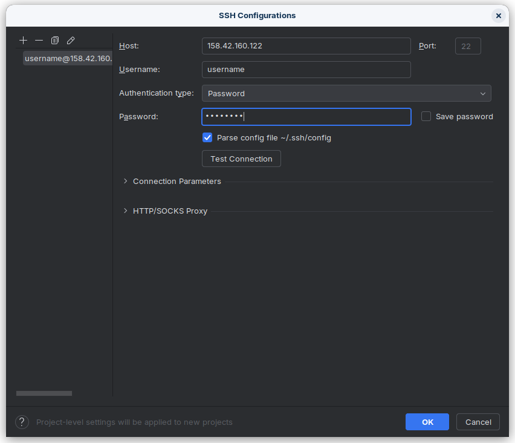

Remote Development
==================

If you have access to a more powerful machine than your personal PC, or for example, your university gives you access
to a server for your research, you can use the built-in remote-development function of the IDE.

PyCharm
-------

In order to develop remotely using PyCharm, we recommend using `Jetbrains Gateway <https://www.jetbrains.com/remote-development/gateway/>`_.
It's a tool provided by Jetbrains, that allows you to connect remotely to servers without having to download an IDE on
your computer. If you already have PyCharm installed on your device, you can use that one, no need to change.

To configure, first choose the "SSH Connection" in "Run the IDE Remotely":

    The home-screen of Jetbrains Gateway.

Now, press the "New Connection" button, and in the new screen, click the cog icon to configure a new connection.

    Click the cog icon

Click the top left "plus" icon.

    Add SSH config

.. tip::

    Your credentials will consist of:

    - A server address (either IP or hostname) and a port (if not given, most likely ``22``)
    - An username
    - A password

    Fill your credentials

Now, fill your credentials. Once you are done, press the "OK" button. And select the profile you have just created.
