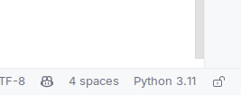
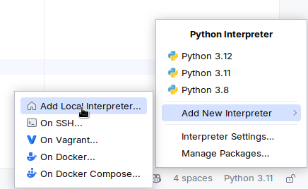
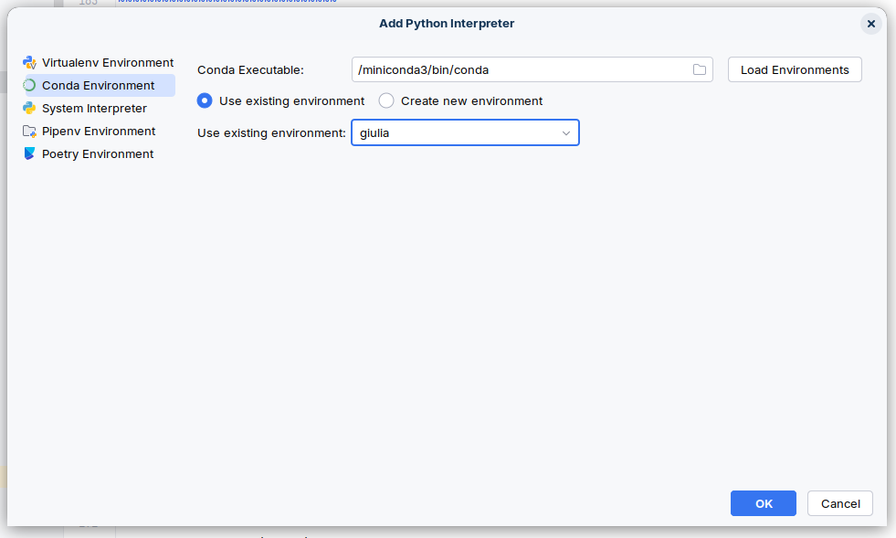
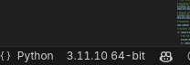
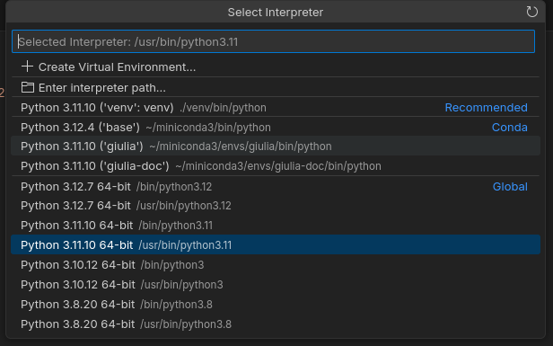
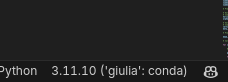

Conda
================

Conda is an open-source package management system and environment management system that runs on Windows, macOS, and
Linux. Conda quickly installs, runs, and updates packages and their dependencies. Conda easily creates, saves, loads,
and switches between environments on your local computer. It was created for Python programs, but it can package and
distribute software for any language.

We use Conda in order to make sure you are using the correct Python version, and that all the required dependencies are
installed, and using the correct versions.

We recommend using a tool called MiniConda, which is a minimal installer for Conda.

1. Install Miniconda
--------------------

To install the latest version of miniconda, follow the instructions here: https://www.anaconda.com/docs/getting-started/miniconda/main

Once you reach this point you have two options.
You can either use the environment we provide, or create a new one.

2a. Creating a Conda environment and installing dependencies
------------------------------------------------------------

2a.1 Create a new environment
~~~~~~~~~~~~~~~~~~~~~~~~~~~~~

To create a new environment, run the following command:

.. code-block:: shell

    conda create --name giulia python=3.11

.. important::

    You can use whatever version **between 3.10 and 3.11** you want. However, we recommend using the latest version.

2a.2. Activate the environment
~~~~~~~~~~~~~~~~~~~~~~~~~~~~~~

To activate the environment, run the following command:

.. code-block:: shell

    conda activate giulia

.. tip::

    To make sure you have activated the environment, you can check the command prompt. If the environment is activated,
    you should see the environment name in the command prompt (``giulia``).

.. note::

    You can create multiple environments depending on what you want to do with the project.
    For example, if you only want to create documentation, create an environment called ``giulia-doc``.
    Or for development, ``giulia-dev``.

2a.3. Install dependencies
~~~~~~~~~~~~~~~~~~~~~~~~~~

To install the dependencies, run the following command:

.. code-block:: shell

    pip install -r requirements.txt

.. note::

    Depending on what you are trying to achieve, there are multiple requirements files. Those are:

    1. ``requirements.txt``: Required dependencies for running the project.
    2. ``requirements-dev.txt``: Required dependencies for development (``requirements.txt`` must also be installed).
    3. ``requirements-doc.txt``: Required dependencies for generating the documentation.

.. hint::

    You must be inside the project's root directory to run this command.

.. note::

    Even though we are running ``pip`` this will only install the dependencies in the current environment.

There are also some non-Python required dependencies. To install them:

.. code-block:: shell

    conda install -c conda-forge cudatoolkit

.. tip::

    Press ``y`` (or simply [enter]) when asked if you want to proceed.

.. important::

    By downloading and using the CUDA Toolkit conda packages, you accept the terms and conditions of the CUDA End User
    License Agreement (EULA): https://docs.nvidia.com/cuda/eula/index.html

2a.4. Export the environment
~~~~~~~~~~~~~~~~~~~~~~~~~~~~

If you want to export the environment to use it in another machine, you can run the following command:

.. code-block:: shell

    conda env export --name giulia > env/environment.yml

2b. Importing a Conda environment
----------------------------------

2a.2. Import the environment
~~~~~~~~~~~~~~~~~~~~~~~~~~~~~~

If you want to import a Conda environment, you can run the following command:

.. tabs::

   .. tab:: Locally (from cloned repository)

        .. code-block:: shell

            conda env create -n giulia --file env/environment.yml

   .. tab:: Remotely (from a URL)

        .. code-block:: shell

            conda env create -n giulia --file https://raw.githubusercontent.com/david-lopez-perez/Giulia/refs/heads/main/env/environment.yml

.. note::

    We provide multiple environments depending on what you are trying to achieve. Those are:

    1. ``environment.yml``: Required dependencies for running the project.
    2. ``environment-dev.yml``: Required dependencies for development.
    3. ``environment-docs.yml``: Required dependencies for generating the documentation.

    Replace ``env/environment.yml`` with the environment you want to import (keep the ``env/`` prefix).

.. tip::

    If you want to have multiple environments on your machine, suffix them with the type of environment you are creating.
    For example, ``giulia-docs`` for the documentation environment.

2a.2. Activate the environment
~~~~~~~~~~~~~~~~~~~~~~~~~~~~~~

To activate the environment, run the following command:

.. code-block:: shell

    conda activate giulia

3. Using the environment from your IDE
--------------------------------------

You can select the Python interpreter to use in your IDE.

3.1. PyCharm
~~~~~~~~~~~~

On the bottom right corner of the IDE, you will see the current Python interpreter.
Click on it, and a dropup will appear.

    Current: Python 3.11

On the drop-up, click on ``Add New Interpreter`` and ``Add Local Interpreter``.

Now, select Conda on the left side, make sure your "Conda Executable" is pointing to the correct path, and select the
environment you want to use ("Use existing environment").

Finally click "Ok". The IDE will switch to that environment automatically, but you can make sure that it's correct by
looking at the bottom right corner.

3.2. Visual Studio Code
~~~~~~~~~~~~~~~~~~~~~~~

To change the Python interpreter in Visual Studio Code, you will first have to open a Python file. If you have clonned
the repository, you can open whatever file ends with ``.py``.

Once the file is open, you will see new options in the right side of the bottom bar of the IDE.

    Current: Python 3.11

Click on the Python version, and a popup window will appear. Select the interpreter you want to use.

.. tip::

    Environments are grouped by types. So you will see all your Conda environments grouped together.

You can make sure you are using the correct environment by looking at the bottom right corner.

